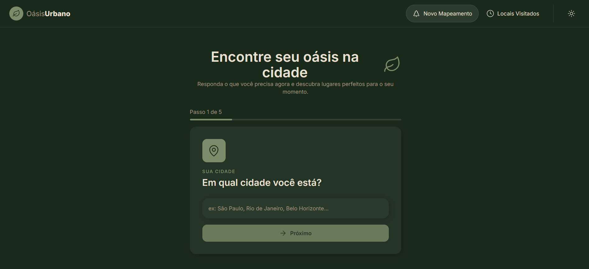
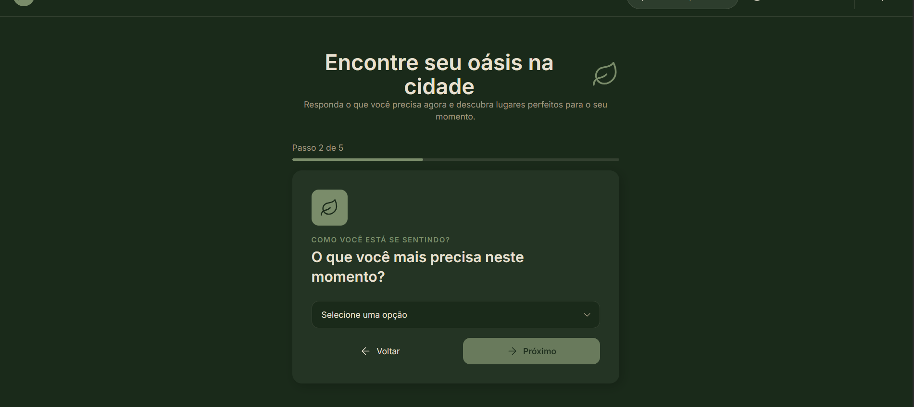
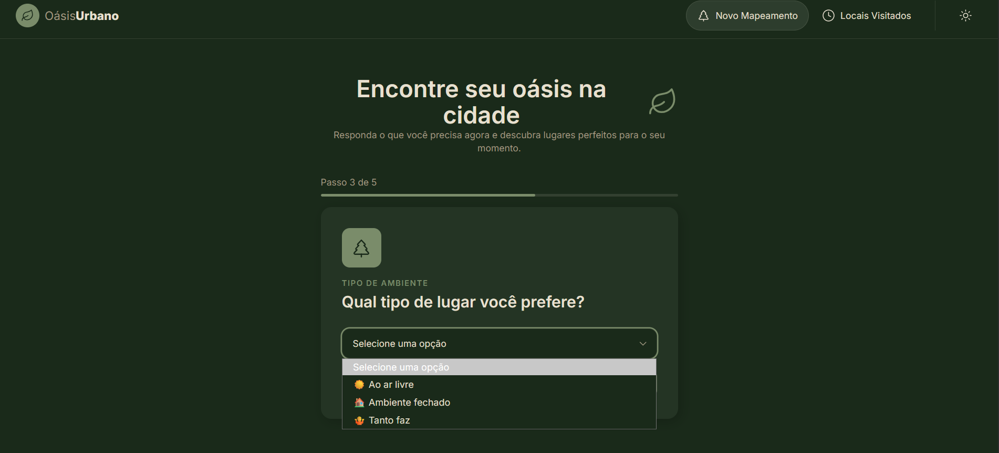
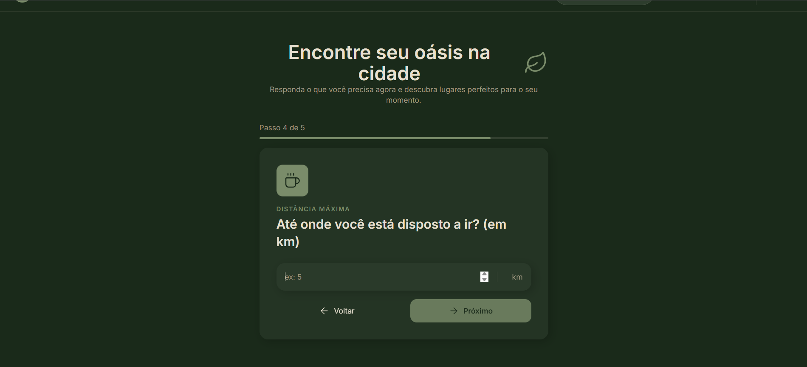
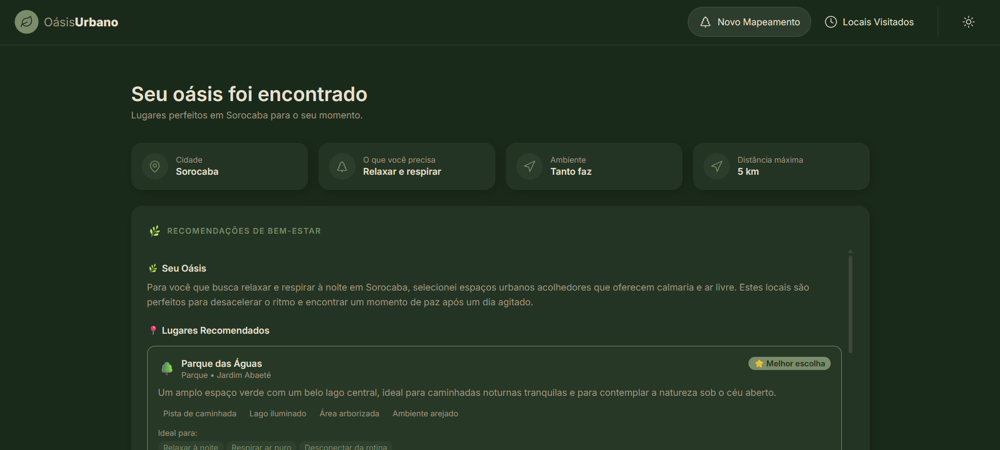

# Oásis Urbano 🌿

Plataforma de saúde mental e bem-estar construída com **React**, **TypeScript** e **IA Generativa** (Google Gemini). A pessoa usuária preenche uma pesquisa personalizada sobre o que precisa naquele momento (relaxar, estudar, se desconectar, contato com natureza) e recebe recomendações curadas de lugares na cidade — parques, bibliotecas, cafés tranquilos, áreas verdes — com rota direta para o Google Maps.

**Objetivo:** Conectar pessoas a espaços que promovem bem-estar urbano, usando tecnologia de forma humanitária e sustentável.

## ✨ O que o projeto faz

1. 

## 📸 Capturas de tela

**Formulário em etapas** — com escuro:

  

Etapa com pergunta de múltipla escolha (interesse em investimentos):

 

**Resultado da simulação**, com o diagnóstico gerado pela IA:

**Histórico de simulações**:

## 🚀 Tecnologias usadas

- **React 19** + **TypeScript**
- **Vite** — build e dev server
- **Tailwind CSS v4** — estilização
- **React Router** — navegação entre páginas
- **Google Gemini API** — geração dos insights e das respostas do chat
- **Context API** — tema claro/escuro
- **localStorage** — persistência de simulações e histórico de chat

